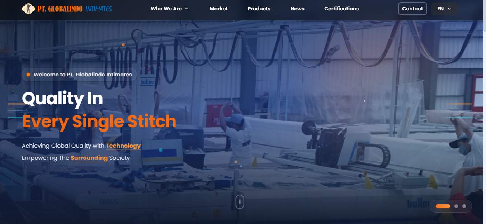

# PT Globalindo Intimates - Corporate Website

<div align="center">
  
  Platform Digital Profil Perusahaan PT Globalindo Intimates
  
  Mengenal lebih dekat visi, misi, dan prestasi PT Globalindo Intimates
  
</div>

---

## Preview



---

## Tentang Website

Website ini merupakan platform digital resmi PT Globalindo Intimates yang dirancang untuk memberikan informasi lengkap tentang perusahaan kepada publik, klien, dan stakeholder. Website mencakup profil perusahaan, produk, fasilitas, program CSR, dan berbagai informasi penting lainnya.

---

## Fitur Utama

- **Who We Are** - Profil lengkap perusahaan, visi, misi, dan nilai-nilai inti
- **Produk** - Katalog lengkap produk pakaian dalam dengan spesifikasi dan galeri foto
- **Fasilitas** - Informasi detail tentang fasilitas produksi dan infrastruktur perusahaan
- **CSR & Program Sosial** - Inisiatif sosial dan tanggung jawab sosial perusahaan
- **Tentang Kami** - Sejarah, pencapaian, dan penghargaan perusahaan
- **Kontak & Lokasi** - Informasi kontak lengkap dan lokasi perusahaan
- **Responsive Design** - Kompatibel di semua perangkat (desktop, tablet, mobile)
- **Performa Optimal** - Loading cepat dengan teknologi modern

---

## Tech Stack

- **Frontend Framework**: React 19.1.1
- **Routing**: React Router DOM 7.9.5
- **Styling**: Tailwind CSS 3.4.13
- **Icons**: Lucide React 0.548.0
- **Build Tool**: Vite 7.1.7
- **CSS Processing**: PostCSS & Autoprefixer
- **Linting**: ESLint 9.36.0
- **Package Manager**: npm

### Tentang Vite

**Vite** adalah build tool modern yang memberikan pengalaman development yang sangat cepat dan efisien. Dengan Vite, kami mendapatkan:

- **Lightning Fast HMR** - Hot Module Replacement yang instan, perubahan kode langsung terlihat di browser tanpa refresh full
- **Optimized Build** - Bundle production yang kecil dan performa tinggi
- **Fast Start** - Server development yang langsung berjalan dalam hitungan milidetik
- **Native ES Modules** - Menggunakan ES modules secara native untuk loading yang lebih cepat

---

## Requirements

- Node.js v16 atau lebih tinggi
- npm v7 atau lebih tinggi

---

## Instalasi & Setup

### Clone Repository
```bash
git clone https://github.com/PKL-Sanatha-Dharma-2k25/globalindo-intimates-web.git
cd globalindo-intimates-web
```

### Install Dependencies
```bash
npm install
```

### Run Development Server
```bash
npm run dev
```

Aplikasi akan berjalan di `http://localhost:5173`

### Build untuk Production
```bash
npm run build
```


---

## Halaman Utama

| Halaman | Deskripsi |
|---------|-----------|
| **Beranda** | Halaman utama dengan hero section, informasi singkat, dan highlights perusahaan |
| **Who We Are** | Profil lengkap, visi, misi, nilai-nilai inti, dan sejarah perusahaan |
| **Produk** | Katalog lengkap produk dengan detail spesifikasi dan galeri foto |
| **Fasilitas** | Informasi mengenai fasilitas produksi, teknologi, dan infrastruktur |
| **CSR** | Program tanggung jawab sosial dan inisiatif sosial perusahaan |
| **Kontak** | Formulir kontak, informasi lokasi, dan detail komunikasi perusahaan |

---

## Cara Menggunakan

1. **Jelajahi Website** - Gunakan navbar untuk navigasi ke berbagai halaman
2. **Pelajari Profil Perusahaan** - Baca tentang visi, misi, dan sejarah di halaman "Who We Are"
3. **Lihat Produk** - Jelajahi katalog produk lengkap dengan spesifikasi detail
4. **Ketahui Fasilitas** - Lihat informasi tentang fasilitas dan teknologi perusahaan
5. **Pelajari Program CSR** - Cari tahu tentang inisiatif sosial perusahaan
6. **Hubungi Kami** - Gunakan form kontak atau lihat informasi kontak di halaman Kontak

---

## Lisensi

Project ini adalah property dari PT Globalindo Intimates. Semua hak cipta dilindungi.

Penggunaan, reproduksi, atau distribusi tanpa izin resmi dilarang.

---

<div align="center">

**Dibuat dengan oleh Sonny Rilman**

Jika project ini bermanfaat, berikan bintang!

**Last Updated**: November 2025

</div>